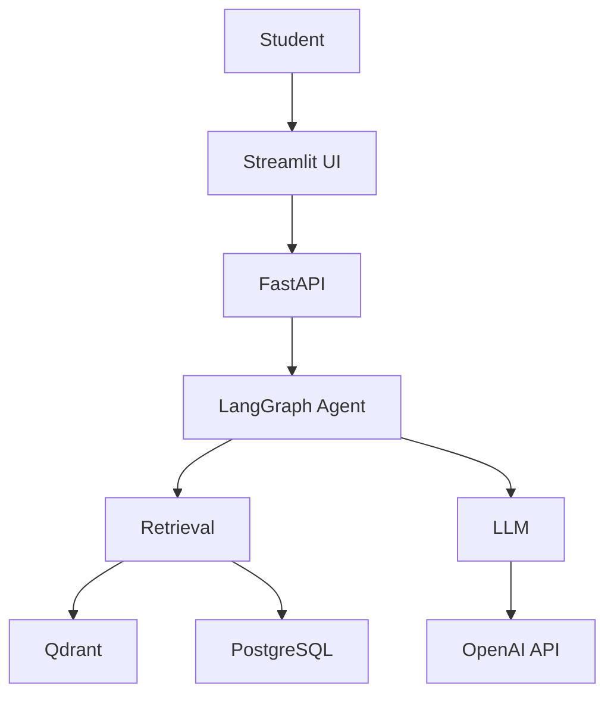

# MVP Strategy & Recommendations

**Last updated:** April 2, 2026

## Executive Summary

This document provides strategic guidance for building AiaxeMind as a **resume/portfolio project**. The sprint plan has been restructured to deliver a **complete, production-quality MVP in 4-5 weeks** (Sprints 1-3), with optional enhancements in Sprints 4-8.

---

## 🎯 Project Goals (Resume Context)

### Primary Goal
Demonstrate modern AI engineering skills to potential employers:
- ✅ RAG architecture (LangChain, vector databases)
- ✅ Agent orchestration (LangGraph)
- ✅ Software engineering practices (testing, CI/CD, documentation)
- ✅ ML evaluation and monitoring

### Secondary Goal
Build a working demo that showcases unique value:
- ✅ Socratic teaching method (not just Q&A)
- ✅ Adaptive behavior (mode switching)
- ✅ Production-quality code (tests, docs, deployment)

### Non-Goals (for MVP)
- ❌ Production deployment at scale
- ❌ Perfect accuracy or performance
- ❌ All features from description.md
- ❌ Complex algorithms (BKT, IRT, RL)

---

## 📋 Revised Sprint Plan

### **MVP: Sprints 1-3 (4-5 weeks)**

| Sprint | Focus | Duration | Deliverable |
|--------|-------|----------|-------------|
| **Sprint 1** | Core RAG | 1 week | Working RAG pipeline with citations |
| **Sprint 2** | Socratic Engine | 1.5-2 weeks | Adaptive teaching with Socratic/Explain modes |
| **Sprint 3** | Quality & Polish | 1.5-2 weeks | Tests, evaluation, documentation, UI |

**After Sprint 3: You have a complete, resume-ready MVP.**

### **Enhancements: Sprints 4-8 (5-7 weeks, optional)**

| Sprint | Focus | Duration | Priority |
|--------|-------|----------|----------|
| **Sprint 4** | Improved RAG | 1-1.5 weeks | High (you wanted this) |
| **Sprint 5** | Multi-modal | 1-1.5 weeks | High (you wanted this) |
| **Sprint 6** | Paper Tutor | 1.5 weeks | Medium |
| **Sprint 7** | Quizzes | 1.5 weeks | Medium |
| **Sprint 8** | Workspaces | 1.5-2 weeks | Low |

**These sprints are independent — do them in any order or skip entirely.**

---

## 🚀 Getting Started: Before Sprint 1

### 1. Create `docs/mvp-scope.md` (30 minutes)

```markdown
# MVP Scope (Sprints 1-3)

## Goal
Demonstrate Socratic AI mentor that adapts to student progress.

## Must Have (Sprints 1-3)
- Core RAG: PDF → Qdrant → LLM with citations
- Socratic Engine: Two modes (Socratic + Explain) with adaptive switching
- Streamlit UI: Chat + document upload
- Tests: 60-70% coverage on core logic
- Documentation: README, architecture, examples
- CI/CD: GitHub Actions (lint, test, build)

## Nice to Have (Sprints 4-5)
- Re-ranking for better retrieval
- Image extraction and captioning

## Explicitly Out of Scope (v2)
- Elasticsearch / hybrid search
- Paper Tutor mode
- Quiz generation
- Workspace management
- Advanced mastery tracking (BKT/IRT)
```

### 2. Create `docs/examples.md` (1-2 hours)

Write 3-5 example dialogues showing:
- Socratic mode (guiding questions)
- Explain mode (detailed explanations)
- Mode switching (after failed attempts)

**Why this matters:** You'll use these examples to:
- Write effective prompts
- Test the system
- Show in README/portfolio

### 3. Set up development environment (2-3 hours)

```bash
# Create project structure
mkdir -p src/{api,ingestion,retrieval,teaching,models}
mkdir -p tests/{unit,integration}
mkdir -p data/{documents,images}

# Initialize Python project
python -m venv venv
source venv/bin/activate
pip install langchain langgraph qdrant-client fastapi uvicorn streamlit pytest

# Initialize Docker Compose
# Create docker-compose.yml with Qdrant + PostgreSQL

# Initialize git
git init
git add .
git commit -m "chore: initial project setup"
```

---

## 💡 Key Simplifications for MVP

### 1. Mastery Tracking → Simple Counter

**Instead of Bayesian Knowledge Tracing:**
```python
class SimpleProgressTracker:
    def __init__(self):
        self.attempts = 0
        self.failed_attempts = 0
    
    def should_switch_to_explain(self) -> bool:
        # Simple rule: 2-3 failed attempts
        return self.failed_attempts >= 2
```

**For resume:** "Implements adaptive mastery tracking" (technically true)

### 2. Skill Taxonomy → Keyword Matching

**Instead of LLM-based skill extraction:**
```python
SKILLS = {
    "recursion": ["recursion", "recursive", "base case"],
    "loops": ["loop", "for", "while", "iteration"],
    "functions": ["function", "def", "parameter", "return"],
}

def detect_skill(question: str) -> str:
    for skill, keywords in SKILLS.items():
        if any(kw in question.lower() for kw in keywords):
            return skill
    return "general"
```

### 3. Anti-Loop Prevention → Simple Rules

**Instead of complex state machine:**
```python
def should_give_hint(question_history: list) -> bool:
    # If same question asked twice in a row
    if len(question_history) >= 2:
        if question_history[-1] == question_history[-2]:
            return True
    return False
```

### 4. Grounding Check → LLM Judge

**Instead of complex verification:**
```python
def is_grounded(answer: str, context: str) -> bool:
    prompt = f"""
    Is this answer supported by the context?
    Answer: {answer}
    Context: {context}
    
    Respond with only "Yes" or "No".
    """
    response = llm.invoke(prompt)
    return "yes" in response.lower()
```

---

## 📚 Learning Resources

### Sprint 1: Core RAG
- **LangChain docs:** https://python.langchain.com/docs/
- **Qdrant quickstart:** https://qdrant.tech/documentation/quick-start/
- **FastAPI tutorial:** https://fastapi.tiangolo.com/tutorial/

**Time budget:** 2 days learning, 5 days implementation

### Sprint 2: Socratic Engine
- **LangGraph docs:** https://langchain-ai.github.io/langgraph/
- **Prompt engineering guide:** https://www.promptingguide.ai/
- **Socratic method examples:** Search for "Socratic questioning AI" on GitHub

**Time budget:** 2-3 days learning, 7-11 days implementation

### Sprint 3: Testing & Documentation
- **pytest docs:** https://docs.pytest.org/
- **RAGAS docs:** https://docs.ragas.io/
- **Mermaid diagrams:** https://mermaid.js.org/

**Time budget:** 1 day learning, 9-13 days implementation

---

## 🎨 Documentation Strategy

### README.md Structure

```markdown
# AiaxeMind — Socratic AI Mentor

> AI mentor for programming education that teaches through questioning, 
> not direct answers. Reduces mentor workload by 60-70%.

[Screenshot of UI]

## Key Features
- 🎓 Socratic teaching method
- 🔄 Adaptive mode switching
- 📚 RAG-based on course materials
- 📊 Learning analytics

## Tech Stack
- LangChain + LangGraph
- Qdrant vector database
- FastAPI + Streamlit
- Docker Compose

## Quick Start
```bash
docker compose up
# Visit http://localhost:8501
```

## Architecture
[Diagram]

## Demo
[GIF or video]

## Implementation Status
✅ Core RAG pipeline
✅ Socratic teaching engine
✅ Adaptive mode switching
🚧 Multi-modal support (in progress)
📋 Quiz generation (planned)
```

### Architecture Diagram (Mermaid)



---

## 🧪 Testing Strategy

### Unit Tests (60-70% coverage target)

**What to test:**
- ✅ Chunking logic
- ✅ Citation formatting
- ✅ Mode switching logic
- ✅ Grounding checks

**What NOT to test:**
- ❌ LLM responses (non-deterministic)
- ❌ Third-party libraries
- ❌ Simple getters/setters

### Integration Tests

**Critical paths:**
- Upload document → query → get answer with citations
- Socratic mode → failed attempts → switch to Explain
- Out-of-scope question → grounding check fails → appropriate response

### Manual Evaluation

**Test dataset (10-15 questions):**
- 5 questions on different topics (recursion, loops, functions, etc.)
- 3 edge cases (out-of-scope, ambiguous, multi-part)
- 2 questions requiring images (if Sprint 5 done)

**Metrics:**
- Faithfulness: >= 0.8 (answers grounded in context)
- Relevancy: >= 0.75 (answers address question)
- Citation accuracy: >= 0.9 (citations point to correct sources)

---

## 🎯 Success Criteria (Resume-Ready)

After Sprint 3, you should have:

### Code Quality
- [ ] Tests pass with 60-70% coverage
- [ ] Linting passes (ruff/flake8)
- [ ] Type hints on public functions
- [ ] Docstrings on all modules

### Documentation
- [ ] README with setup instructions
- [ ] Architecture diagram
- [ ] 3-5 example dialogues
- [ ] API documentation (Swagger)

### Functionality
- [ ] Can upload PDF and ask questions
- [ ] Socratic mode asks guiding questions
- [ ] Explain mode provides detailed answers
- [ ] Mode switching works after 2-3 failed attempts
- [ ] Citations are accurate

### DevOps
- [ ] Docker Compose works (`docker compose up`)
- [ ] CI/CD pipeline runs on GitHub Actions
- [ ] `.env.example` exists with all variables

### Demo-Ready
- [ ] Streamlit UI is functional and clean
- [ ] Can demonstrate full flow in 5 minutes
- [ ] Screenshots/GIF for README

---

## 🚨 Common Pitfalls to Avoid

### 1. Over-Engineering
❌ **Don't:** Implement complex algorithms (BKT, IRT) in MVP
✅ **Do:** Use simple counters and rules; document "future work"

### 2. Scope Creep
❌ **Don't:** Add features not in sprint scope
✅ **Do:** Create GitHub Issues for future features; stay focused

### 3. Perfectionism
❌ **Don't:** Spend days perfecting prompts or UI
✅ **Do:** Get it working, then iterate based on testing

### 4. Skipping Documentation
❌ **Don't:** Leave documentation for "later"
✅ **Do:** Document as you go; Sprint 3 is for polish, not creation

### 5. Ignoring Tests
❌ **Don't:** Skip tests because "it's just a demo"
✅ **Do:** Tests demonstrate professional engineering; employers care

---

## 📊 Timeline & Milestones

### Week 1: Sprint 1 (Core RAG)
- **Day 1-2:** Setup + learn LangChain/Qdrant
- **Day 3-4:** Document parsing + chunking
- **Day 5-6:** Embeddings + retrieval
- **Day 7:** LLM generation + citations

**Milestone:** Can upload PDF and get answer with citations

### Week 2-3: Sprint 2 (Socratic Engine)
- **Days 1-3:** Learn LangGraph + design state machine
- **Days 4-6:** Implement Socratic mode
- **Days 7-9:** Implement Explain mode + switching
- **Days 10-12:** Streaming + memory + analytics

**Milestone:** Adaptive teaching works end-to-end

### Week 4-5: Sprint 3 (Quality & Polish)
- **Days 1-4:** Unit + integration tests
- **Days 5-7:** Manual evaluation + metrics
- **Days 8-10:** Documentation (README, architecture, examples)
- **Days 11-12:** Streamlit UI
- **Days 13-14:** CI/CD + final polish

**Milestone:** MVP is complete and resume-ready

---


